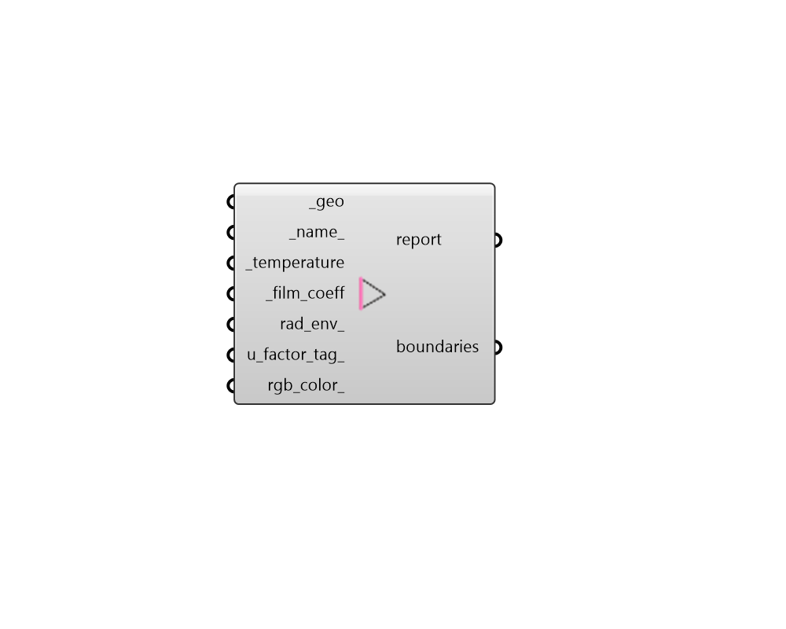

## FF Boundary

Create Fairyfly Boundary. 

#### Inputs
* ##### geo [Required]
Planar Polyline or Line geometry representing the boundary. 
* ##### name 
Optional text for the name of the boundary. If unspecified, a generic one will be automatically assigned. 
* ##### temperature [Required]
A number for the temperature at the boundary in degrees Celsius. For NFRC conditions, this temperature should be 21C for interior boundary conditions and -18 C for winter exterior boundary conditions. 
* ##### film_coeff [Required]
A number in W/m2-K that represents the convective resistance of the air film at the boundary condition. Typical film coefficient values range from 36 W/m2-K (for an exterior condition where outdoor wind strips away most convective resistance) to 2.5 W/m2-K (for a vertically-oriented interior wood/vinyl surface). For NFRC conditions, this should be 26 for exterior boundary conditions and around 3 for interior boundary conditions. 
* ##### rad_env 
The optional output of the "FF Radiant Environment" component, which can be used to customize the radiant properties of the boundary (if they differ from the input _temperature and standard emissivity of 1 or if there is additional solar heat flux along the boundary). 
* ##### u_factor_tag 
An optional text string for to define a U-Factor tag along the boundary condition. This tag is used tell THERM the boundary on which a net U-Value shall be computed. Typical values to input here, which are recognizable in LBNL WINDOW include the following. 

    * Frame

    * Edge

    * Spacer

    * ShadeInETag

    * ShadeOutETag

    * SHGC Exterior
* ##### rgb_color 
An optional color to set the color of the material when it is imported to THERM. All materials from the Fairyfly Therm Library already possess colors but materials from the HB-Energy material lib will have a randomly-generated color if none is assigned here. 

#### Outputs
* ##### report
Reports, errors, warnings, etc. 
* ##### boundaries
Fairyfly boundaries. These can added to Fairyfly models and used in THERM simulation. 