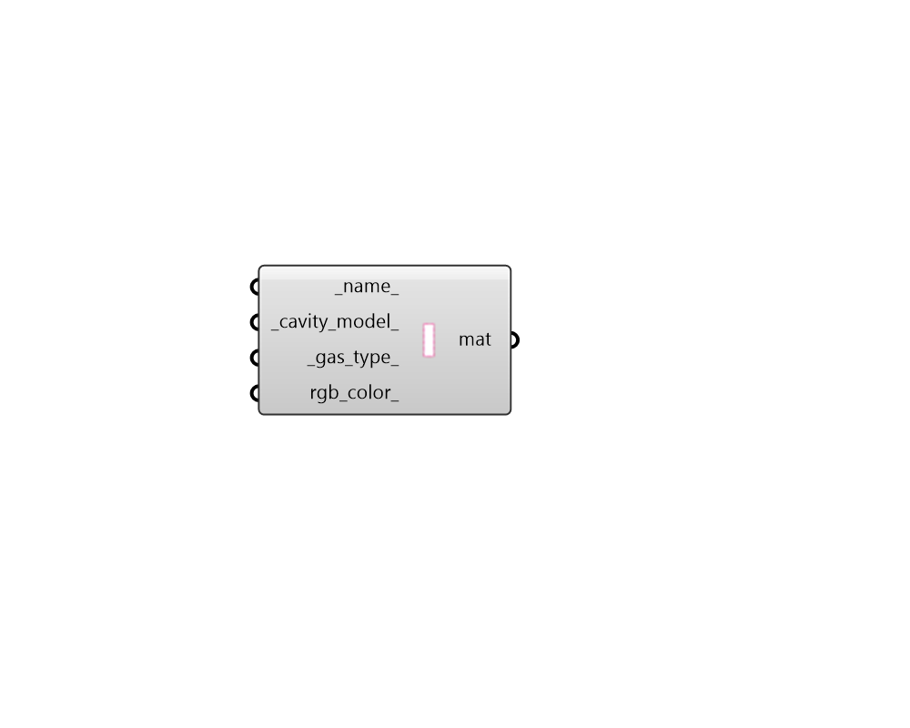

## FF Cavity Material

Create a custom cavity material, which can be plugged into the "FF Shape" component to change the properties of the material in a THERM simulation. 

#### Inputs
* ##### name 
Text to set the name for the material. 
* ##### cavity_model 
Text for the type of cavity model to be used to determine the thermal resistance of the material. (Default: CEN). Choose from the following. 

    * CEN

    * NFRC

    * ISO15099

    * ISO15099Ventilated
* ##### gas_type 
Text describing the types of gas in the gap. (Default: Air). Text must be one of the following: 'Air', 'Argon', 'Krypton', 'Xenon'. 
* ##### rgb_color 
An optional color to set the color of the material when it is imported to THERM. If unspecified, a randomly-generated color is assigned. 

#### Outputs
* ##### mat
A cavity material that can be assigned to a Fairyfly Shape to change the properties of the material in a THERM simulation. 