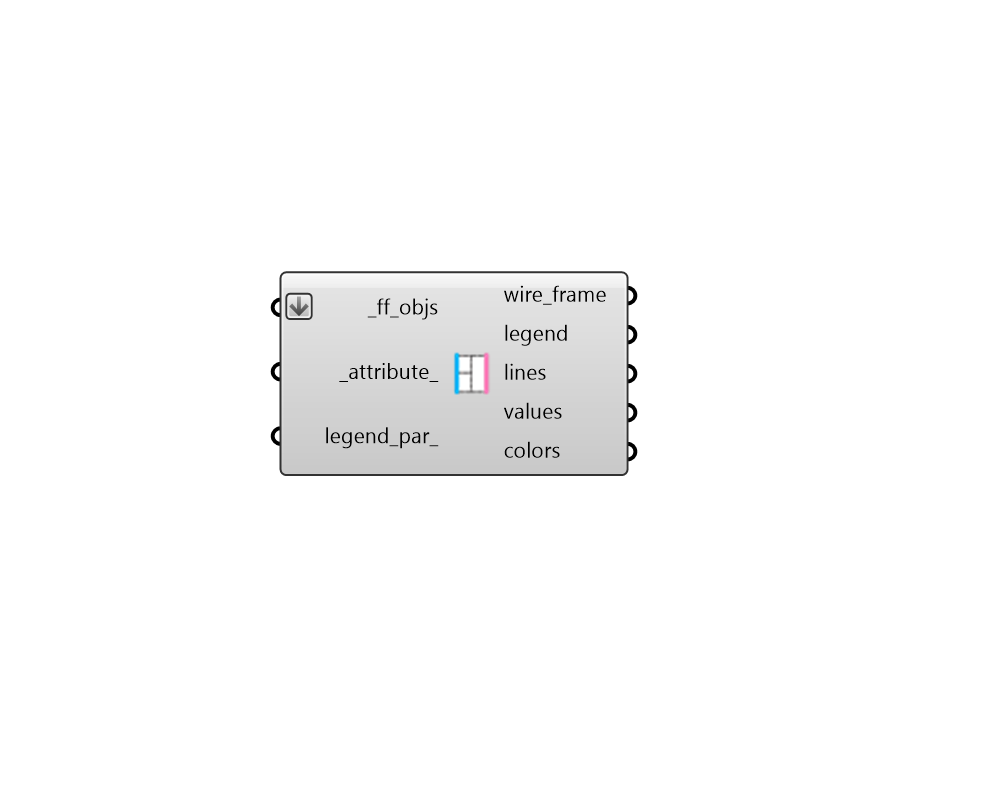

## FF Color Boundary Attributes

Color Fairyfly Boundaries in the Rhino scene using their attributes. 

This can be used as a means to check that correct properties are assigned to different boundaries. 

#### Inputs
* ##### ff_objs [Required]
An array of fairyfly Boundaries to be colored with their attributes in the Rhino scene. This can also be an entire Model to be colored. 
* ##### attribute 
Text for the name of the attribute with which the boundaries should be colored. The "FF Boundary Attributes" component lists all of the attributes of the boundary. (Default: THERM Condition). 
* ##### legend_par 
An optional LegendParameter object to change the display of the colored boundaries (Default: None). 

#### Outputs
* ##### wire_frame
A list of lines representing the outlines of the _ff_objs. 
* ##### legend
Geometry representing the legend for colored lines. 
* ##### lines
Line segments of the boundaries colored according to their attributes. 
* ##### values
A list of values noting the attribute assigned to each boundary. 
* ##### colors
A list of colors noting the color of each boundary in the Rhino scene. This can be used in conjunction with the native Grasshopper "Custom Preview" component to create custom visualizations in the Rhino scene. 