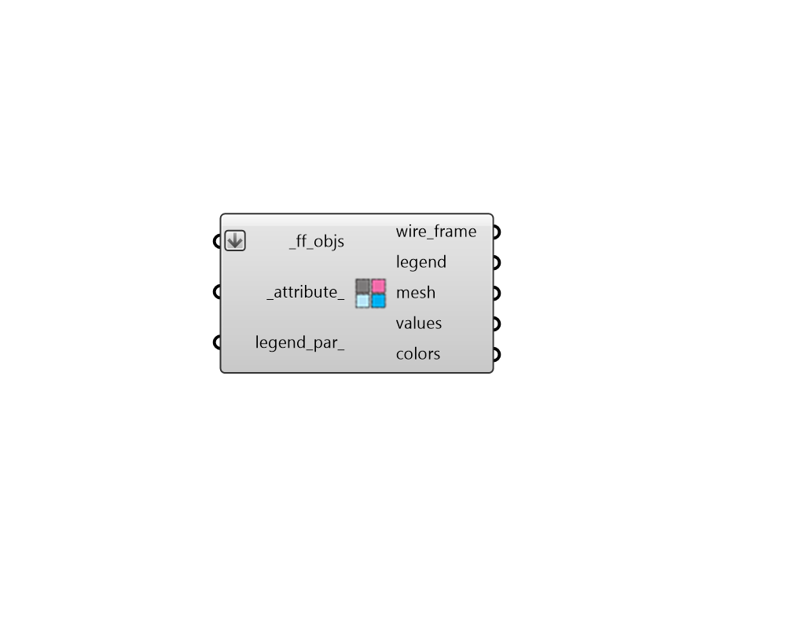

## FF Color Shape Attributes

Color Fairyfly Shapes in the Rhino scene using their attributes. 

This can be used as a means to check that correct properties are assigned to different shapes. 

#### Inputs
* ##### ff_objs [Required]
An array of fairyfly Shapes to be colored with their attributes in the Rhino scene. This can also be an entire Model to be colored. 
* ##### attribute 
Text for the name of the attribute with which the shapes should be colored. The "FF Shape Attributes" component lists all of the attributes of the shape. (Default: THERM Material). 
* ##### legend_par 
An optional LegendParameter object to change the display of the colored shapes. (Default: None). 

#### Outputs
* ##### wire_frame
A list of lines representing the outlines of the _ff_objs. 
* ##### legend
Geometry representing the legend for colored meshes. 
* ##### mesh
Meshes of the shapes colored according to their attributes. 
* ##### values
A list of values noting the attribute assigned to each shape. 
* ##### colors
A list of colors noting the color of each shape in the Rhino scene. This can be used in conjunction with the native Grasshopper "Custom Preview" component to create custom visualizations in the Rhino scene. 