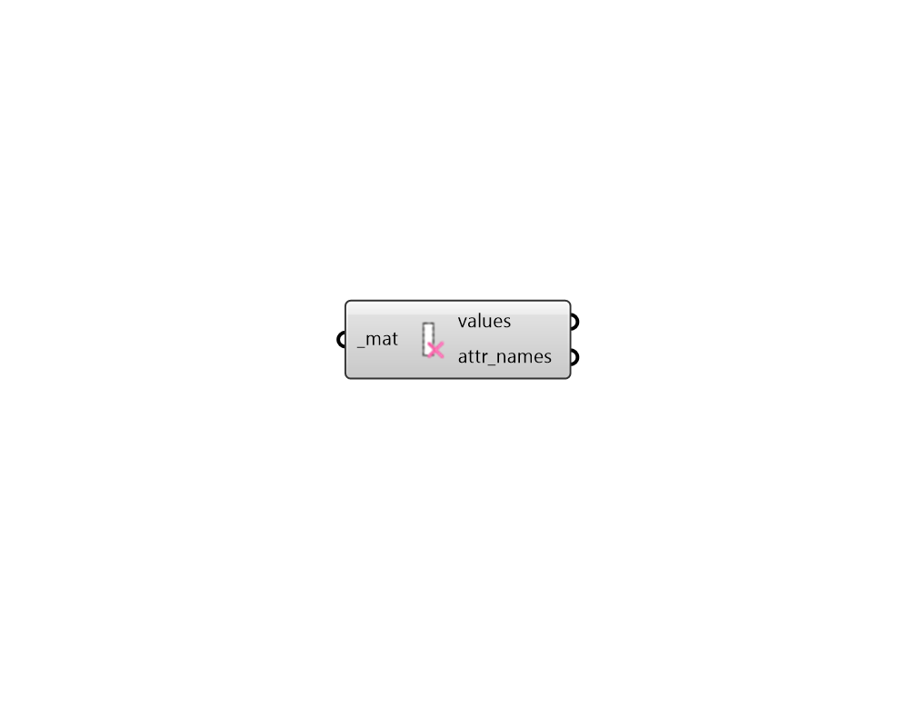

## FF Deconstruct Material

Deconstruct a material into its constituient attributes and values. 

#### Inputs
* ##### mat [Required]
A material to be deconstructed. This can also be text for a material to be looked up in the material library. 

#### Outputs
* ##### values
List of values for the attributes that define the material. 
* ##### attr_names
List of text that is the same length as the values, which notes the attribute name for each value. 