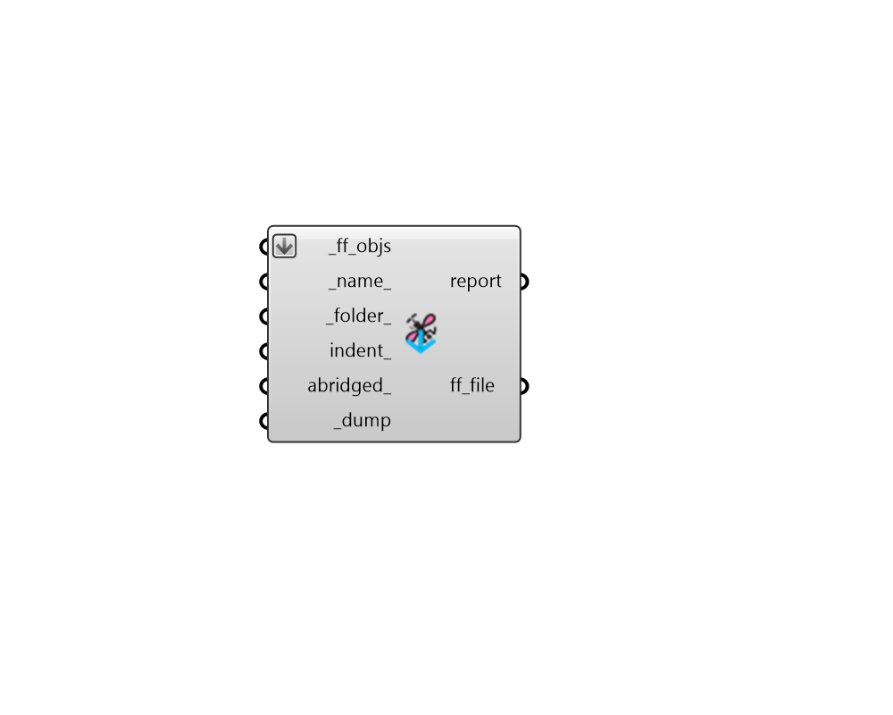

## FF Dump Objects

Dump any fairyfly object to a JSON file. You can use "FF Load Objects" component to load the objects from the file back into Grasshopper. 

Fairyfly objects include any fairyfly Model, Material, or Boundary. 

#### Inputs
* ##### ff_objs [Required]
A list of Fairyfly objects to be written to a file. 
* ##### name 
A name for the file to which the fairyfly objects will be written. (Default: 'unnamed'). 
* ##### folder 
An optional directory into which the fairyfly objects will be written.  The default is set to the default simulation folder. 
* ##### indent 
An optional positive integer to set the indentation used in the resulting JSON file. 
* ##### abridged 
Set to "True" to serialize the object in its abridged form. Abridged objects cannot be reserialized back to fairyfly objects on their own but they are used throughout fairyfly to minimize file size and unnecessary duplication. 
* ##### dump [Required]
Set to "True" to save the fairyfly objects to file. 

#### Outputs
* ##### report
Errors, warnings, etc. 
* ##### ff_file
The location of the file where the fairyfly JSON is saved. 