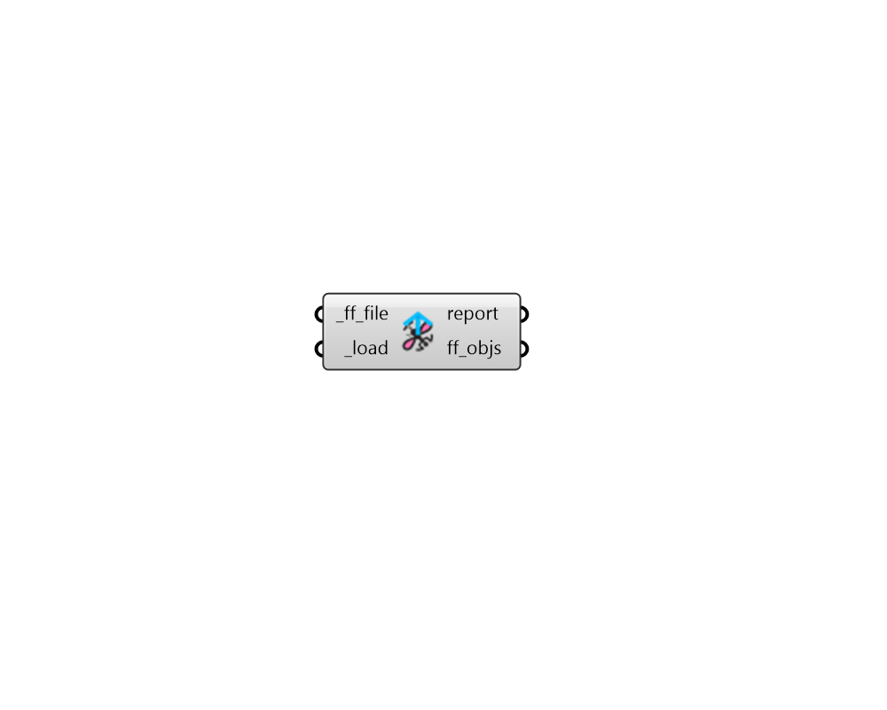

## FF Load Objects

Load any fairyfly object from a fairyfly JSON file 

Fairyfly objects include any Model, Shape, or Boundary. 

It also includes any fairyfly Material or Simulation object. 

#### Inputs
* ##### ff_file [Required]
A file path to a fairyfly JSON from which objects will be loaded back into Grasshopper. The objects in the file must be non-abridged in order to be loaded back correctly. 
* ##### load [Required]
Set to "True" to load the objects from the _ff_file. 

#### Outputs
* ##### report
Reports, errors, warnings, etc. 
* ##### ff_objs
A list of fairyfly objects that have been re-serialized from the input file. 