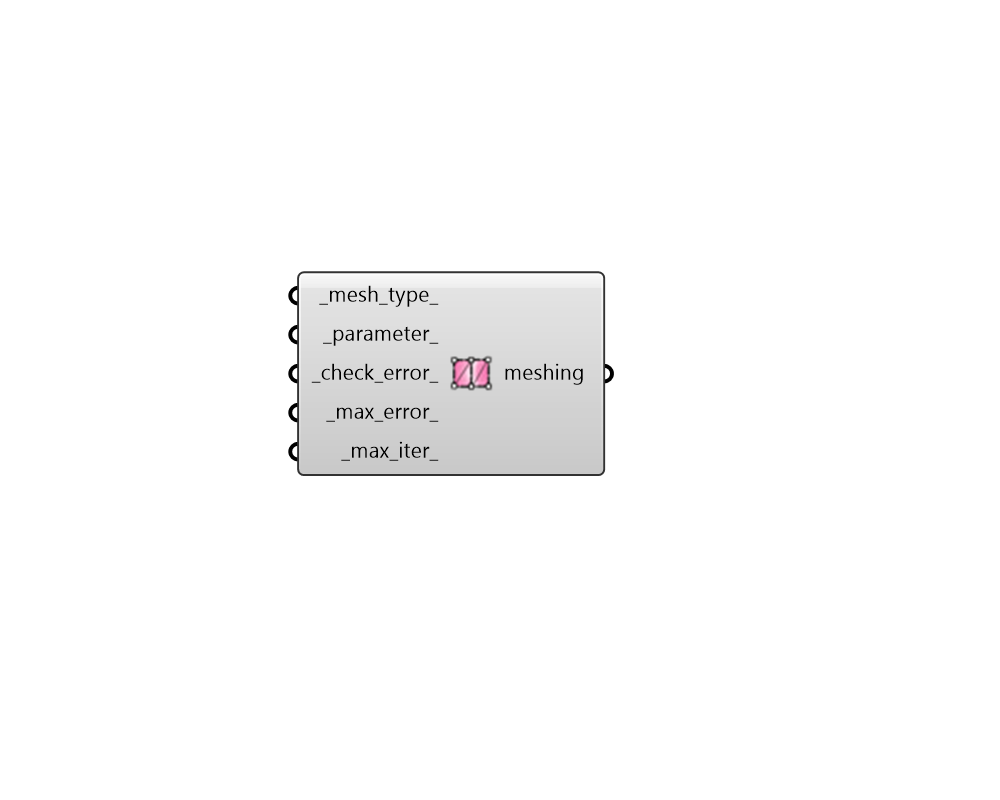

## FF Meshing Control

Create parameters with criteria for meshing THERM geometry. 

#### Inputs
* ##### mesh_type 
Text to indicate the type of meshing algorithm to use. Choose from the following. Simmetrix is generally more flexible and capable of handling more complex geometry when compared with the QuatTree. However, the structure of QuadTree meshes is more predictable. (Default: Simmetrix). 

    * Simmetrix

    * QuadTree
* ##### parameter 
A positive integer for the minimum number of subdivisions to be performed while meshing the input geometry. The higher the mesh control parameter, the smaller the maximum size of finite elements in the model and the smoother the results will appear. However, higher mesh parameters will also require more time to run. (Default: 20). 
* ##### check_error 
Boolean to note whether the error estimator should be run as part of the finite element analysis. If the global error is above a specified value, then the error estimator signals the mes generator, and the mesh is refined in areas where the potential for error is high.  The refined mesh is sent back to the finite element solver, and a new solution is obtained. (Default: True). 
* ##### max_error 
A number between 0 and 100 for the percent error energy norm used by the error estimator. This is the maximum value of the error energy divided by the energy of the sum of the recovered fluxes and the error, multiplied by 100. (Default: 10). 
* ##### max_iter 
A positive integer for the number of iterations between the error estimator and the solver to be performed before the finding a solution is abandoned and the program exits. (Default: 5). 

#### Outputs
* ##### meshing
Parameters with criteria for creating the finite element mesh. These can be connected to the "FF Model to THMZ" component in order to specify settings for the THERM simulation. 