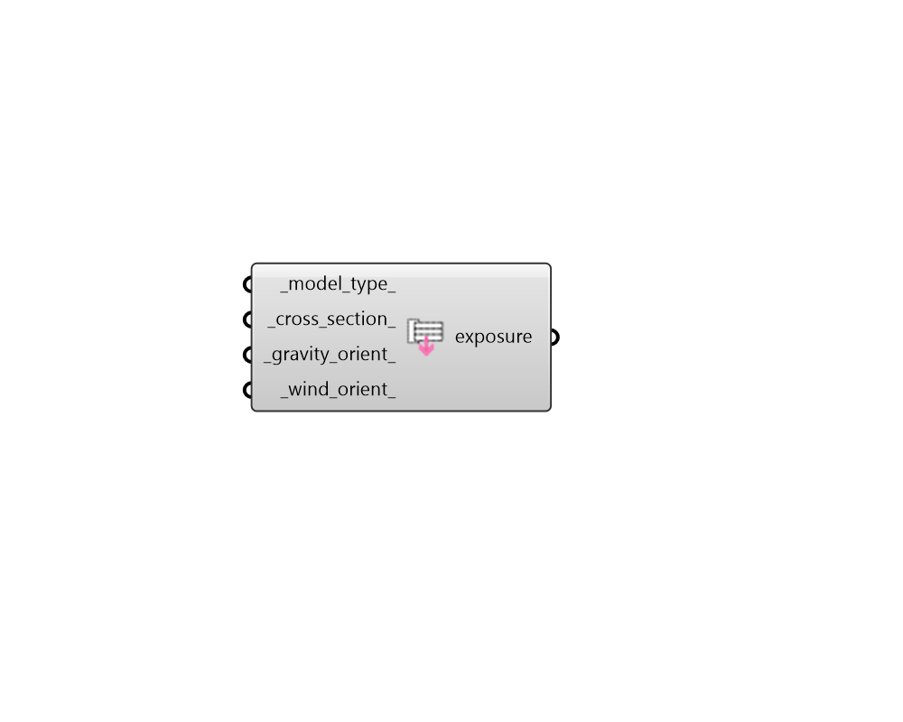

## FF Model Exposure

Create parameters for THERM model exposure, that describes the model's location within a larger building. 

#### Inputs
* ##### model_type 
Text to indicate the type of construction detail or the purpose of the model. Chose from the following. (Default: Other). 

    * Window

    * Opaque Wall

    * Opaque Roof

    * Other
* ##### cross_section 
Text to indicate the type of cross section that the model represents. The acceptable fields here depend upon the model_type. If unspecified, the default is set to the top of each list below for each model_type. 
For the Window model_type, choose from the following. 

    * Sill

    * Jamb

    * Head

    * Horizontal Divider

    * Vertical Divider

    * Horizontal Meeting Rail

    * Vertical Meeting Rail

    * Common Frame

    * Spacer
For the Opaque Wall and Roof model_type, choose from the following. 

    * Sill Plate

    * Header

    * End Section

    * Middle Section

    * Thermal Bridge

    * Window Framing - Sill

    * Rough Opening - Header

    * Rough Opening - Jamb
For the Other model_type, choose from the following. 

    * General Cross Section

    * Common Thermal Bridge
* ##### gravity_orient 
Text to indicate the direction of gravity for the model. If unspecified,  this will be computed from the orientation of the model's plane in the 3D scene. 

    * Down

    * Up

    * Left

    * Right

    * Into Screen

    * Out Of Screen
* ##### wind_orient 
A number between 0 and 360 for the direction the exterior surface of the model faces. This orientation of the exterior surface is used to determine the wind direction for the simulation. (Default: 0). For reference, 0 = North, 90 = East, 180 = South, 270 = West. 

#### Outputs
* ##### exposure
Parameters for THERM model exposure, that describes the model's location within a larger building. These can be connected to the "FF Model to THMZ" component in order to specify settings for the THERM simulation. 