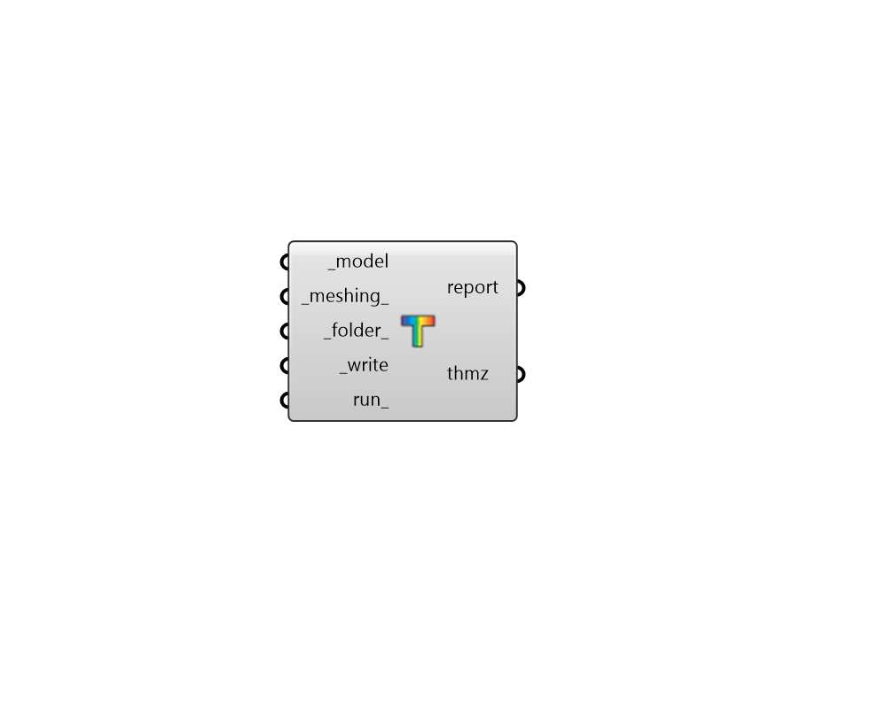

## FF Model to THMZ

Write a fairyfly Model to an THMZ file (aka. THERM Zip file), which can then be simulated or opened in the THERM interface. 

#### Inputs
* ##### model [Required]
A fairyfly model object possessing all geometry and therm simulation properties. 
* ##### meshing 
An optional MeshControl object that describes how the input model geometry shall be meshed for finite element analysis. This can be generated from the "FF Meshing Control" component. Default: uses the Simmetrix mesher with a parameter of 20. 
* ##### folder 
An optional folder on this computer, into which the THMZ file will be written. 
* ##### write [Required]
Set to "True" to write the THMZ file from the fairyfly Model. 
* ##### run 
Set to "True" to simulate the THMZ file in THERM once it is written. This will ensure that results are embedded within the output THMZ file such that they can be visualized with the "FF Read THERM Result" component. 
This input can also be the integer "2", which will run the whole translation and simulation silently (without any batch windows). 

#### Outputs
* ##### report
A detailed report of the THMZ translation and simulation. 
* ##### thmz
The file path of the THMZ file that has been written from the model. 