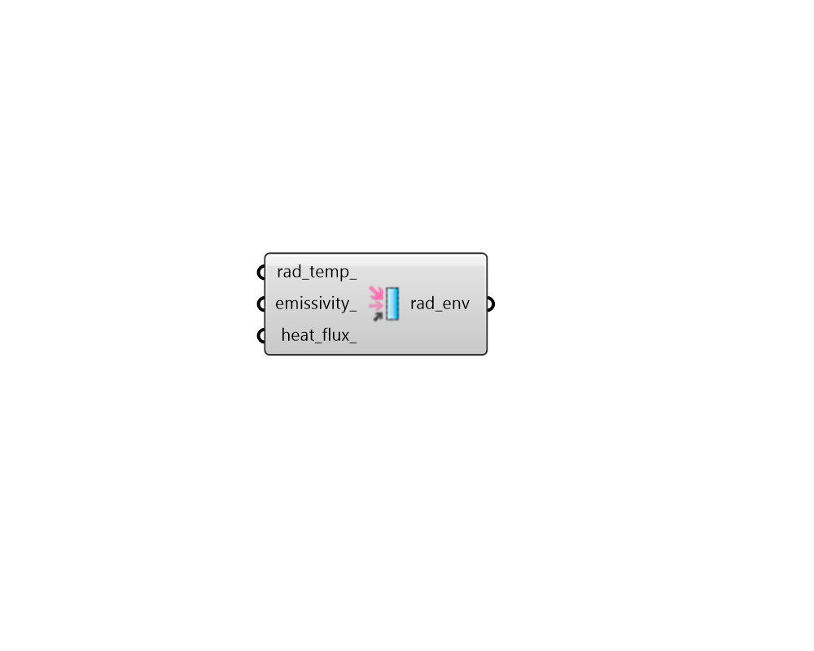

## FF Radiant Environment

Create a custon radiant environment for Fairyfly boundary. 

Assigning values here will create radiant conditions that are different from stanbdard NFRC conditions (where radiant temperature equals air temperature, the emissivity of the environment is 1, and there is no additional heat flux). 

#### Inputs
* ##### rad_temp 
A number for the radiant temperature at the boundary in degrees Celsius. If None, this will be the same as the specified air temperature. (Default: None). 
* ##### emissivity 
An optional number between 0 and 1 to set the emissivity along the boundary, which represents the emissivity of the environment to which the material in contact with the boundary is radiating to. (Default: 1). 
* ##### heat_flux 
An optional number in W/m2 that represents additional energy flux across the boundary. This can be used to account for solar flux among other forms of heat flux. (Default: 0). 

#### Outputs
* ##### rad_env
Radiant environment properties that can be plugged into the "FF Boundary" component in order to customize the radiant environment within THERM simulation. 