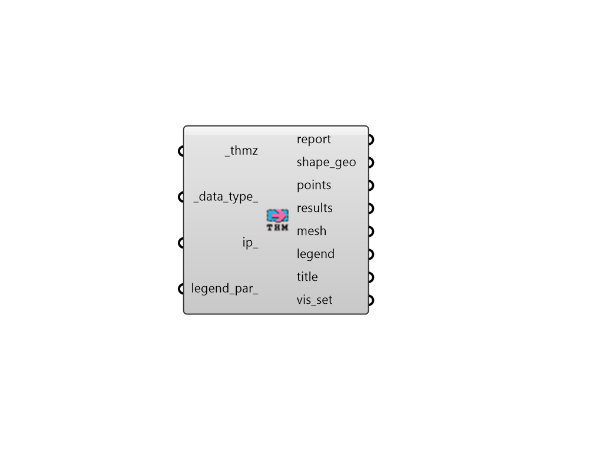

## FF Read THERM Result

Create Fairyfly Boundary. 

#### Inputs
* ##### thmz [Required]
Path to a THMZ file that has been simulated in THERM. This can be the direct output of the "FF Model to THMZ" component as long as run_ has been set to True. 
* ##### data_type 
Optional text or an integer to set the type of result data to import from the THMZ file. Choose from the following options. (Default: Temperature) 0 - Temperature (C or F) 1 - Heat Flux (W/m2 or Btu/h-ft2) 
* ##### ip 
Set to True to have all data imported with IP Units (Farenheit and Btu/h-ft2) instead of the default SI units of Celsius and W/m2. 
* ##### legend_par 
Optional legend parameters from the "LB Legend Parameters" that will be used to customize the display of the results. 

#### Outputs
* ##### report
Reports, errors, warnings, etc. 
* ##### shape_geo
A list of breps for the geometry of the Shapes contained within the THMZ file. The edges of these shapes can be used to overlay wireframe visualizations on top of the result mesh. 
* ##### points
The grid of points representing the nodes of the mesh generated by THERM. 
* ##### results
A list of numbers that aligns with the points. Each number indicates the temeprature (or heat flux) at each of the points. 
* ##### mesh
A colored mesh produced from the model's shapes representing the temperature or heat flow through the construction. 
* ##### legend
A legend showing the values that correspond to the colors of the mesh. 
* ##### title
A text object for the study title. 
* ##### vis_set
A VisualizationSet object for drawing a detailed version of the Therm results in the Rhino scene. This can be connected to the "LB Preview Visualization Set" component to display this version of the results in Rhino. 