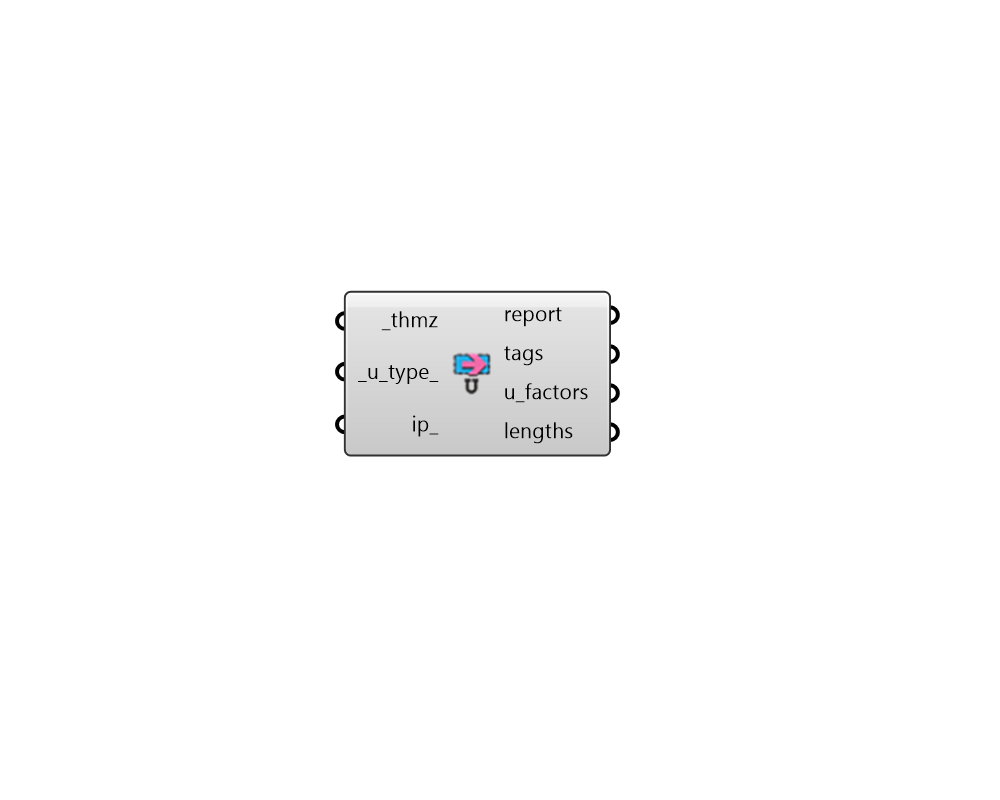

## FF Read UFactor Result

Create Fairyfly Boundary. 

#### Inputs
* ##### thmz [Required]
Path to a THMZ file that has been simulated in THERM. This can be the direct output of the "FF Model to THMZ" component as long as run_ has been set to True. 
* ##### u_type 
Optional text or an integer to set the type of U-Factor to import from the THMZ file if something other than the U-Factor along the total boundary length is desired. Choose from the following options. (Default: Total) 0 - Total 1 - Projected X 2 - Projected Y 3 - Projected in Glass Plane 4 - Custom Rotation 
* ##### ip 
Set to True to have all data imported with IP Units (Btu/h-ft2-F and in) instead of the default SI units of W/m2-K and mm. 

#### Outputs
* ##### report
Reports, errors, warnings, etc. 
* ##### tags
The names of each of the U-Factor tags in the THMZ file. 
* ##### u_factors
The U-Factors accross each boundary that was labeled with a U-Factor tag. This will be in W/m2-K by default unless ip_ is set to True in which case it will be in Btu/h-ft2-F. 
* ##### lengths
The proejcted lengths of each boundary that was labeled with a U-Factor tag. This will be the total length of the boundary if the default u_type of "Total" has been used and will account for the length only in the projection plane if a different u_type is used. Values are in mm by default unless ip_ is set to True, in which case it will be in inches. 