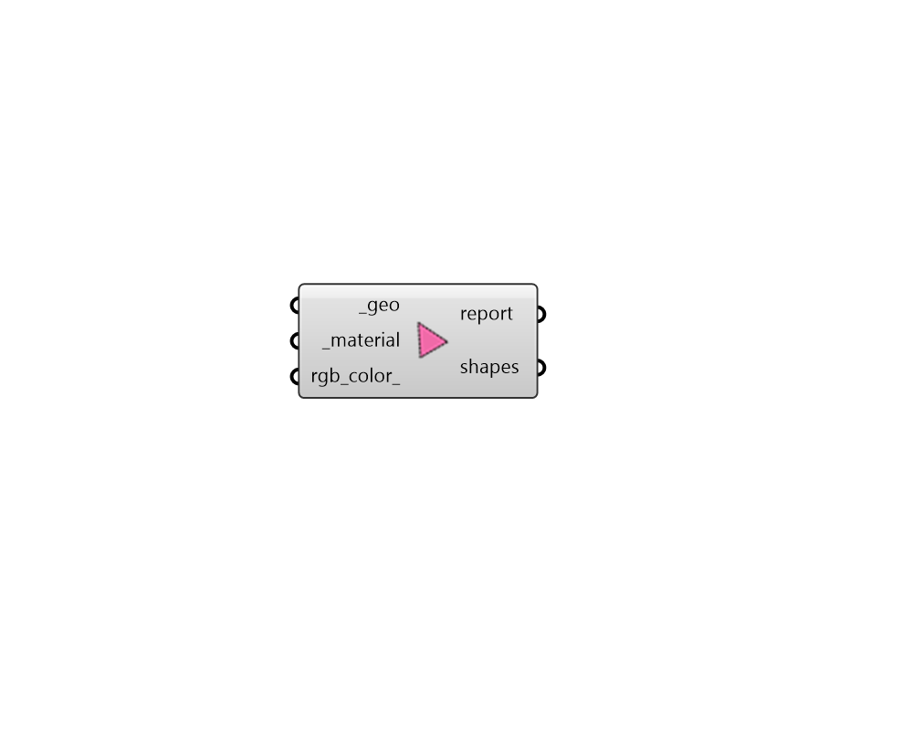

## FF Shape

Create Fairyfly Shape. 

#### Inputs
* ##### geo [Required]
Rhino Brep or planar Polyline geometry. 
* ##### material [Required]
Optional text for the Shape's THERM material to be looked up in the material library (see the "FF Search Materials" component for a full list of materials that ship with THERM). This input can also be a custom SolidMaterial or CavityMaterial object created from the corresponding component. Lastly, it can be text for the name of a HB-Energy material to be looked up in the material library (see the ""HB Search Materials" component for a full list of materials that ship with Honeybee). 
* ##### rgb_color 
An optional color to set the color of the material when it is imported to THERM. All materials from the Fairyfly Therm Library already possess colors but materials from the HB-Energy material lib will have a randomly-generated color if none is assigned here. 

#### Outputs
* ##### report
Reports, errors, warnings, etc. 
* ##### shapes
Fairyfly shapes. These can be used in THERM simulation. 