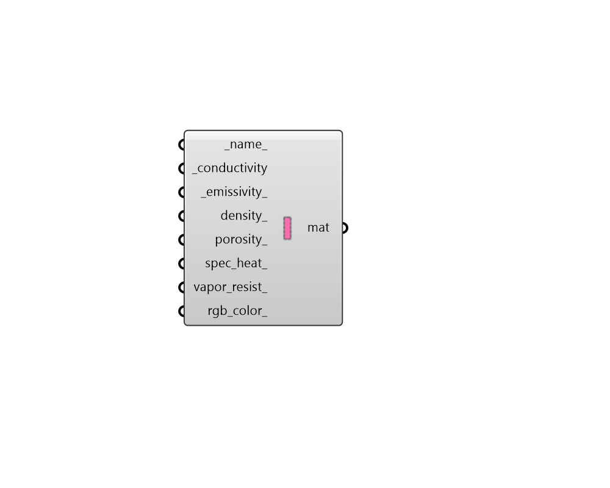

## FF Solid Material

Create a custom solid material, which can be plugged into the "FF Shape" component to change the properties of the material in a THERM simulation. 

#### Inputs
* ##### name 
Text to set the name for the material. 
* ##### conductivity [Required]
Number for the thermal conductivity of the material [W/m-K]. 
* ##### emissivity 
Number between 0 and 1 for the infrared hemispherical emissivity of the material. (Default: 0.9). 
* ##### density 
Number for the density of the material [kg/m3]. 
* ##### porosity 
Optional number between 0 and 1 for the porosity of the material. 
* ##### spec_heat 
Number for the specific heat of the material [J/kg-K]. 
* ##### vapor_resist 
Optional number for the water vapor diffusion resistance factor. 
* ##### rgb_color 
An optional color to set the color of the material when it is imported to THERM. If unspecified, a randomly-generated color is assigned. 

#### Outputs
* ##### mat
A standard solid material that can be assigned to a Fairyfly Shape to change the properties of the material in a THERM simulation. 