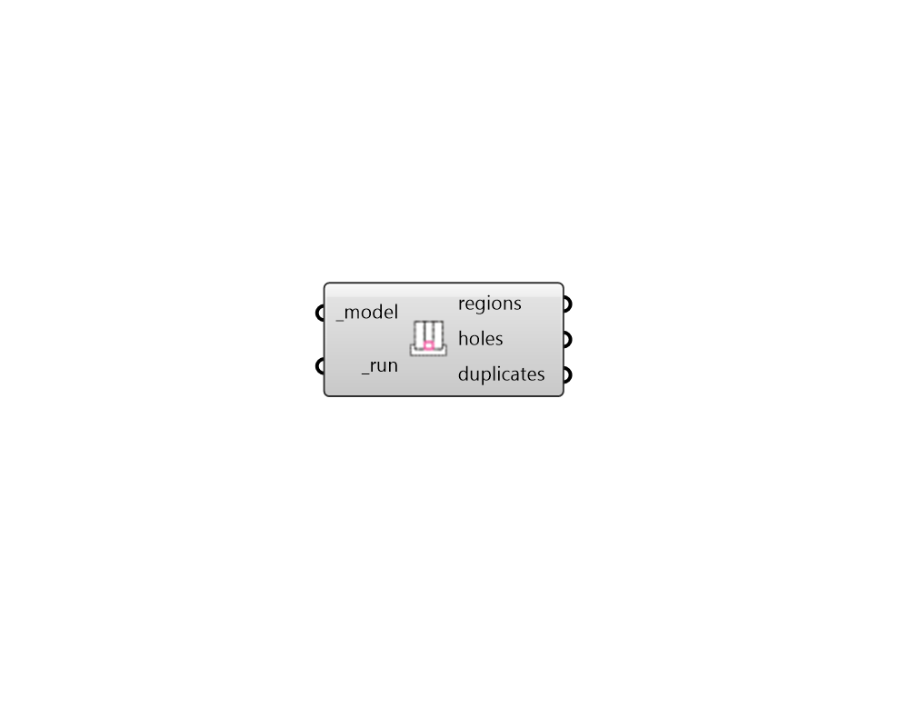

## FF Visualize Problem Areas

Identify problematic areas in Fairyfly models that make them un-simulate-able. 

These inclue "problem regions," which identify cases where there are two or more groups of shapes that are disconnected from one another. 

It also includes "problem holes," which identify cases of gaps or holes within a larger connected region of shapes. 

#### Inputs
* ##### model [Required]
A Fairyfly Model for which problem regions are to be visualized. 
* ##### run [Required]
Set to "True" to run the component and visualize problem areas. 

#### Outputs
* ##### regions
Polylines for regions of shapes that are disconnected from one another and are therefore un-simulate-able. 
* ##### holes
Polylines for holes in the model that make it un-simulate-able. 
* ##### duplicates
A list of Surfaces for duplicate shape geometries in the model. This list will also include line segments for any duplicate boundaries in the model. 